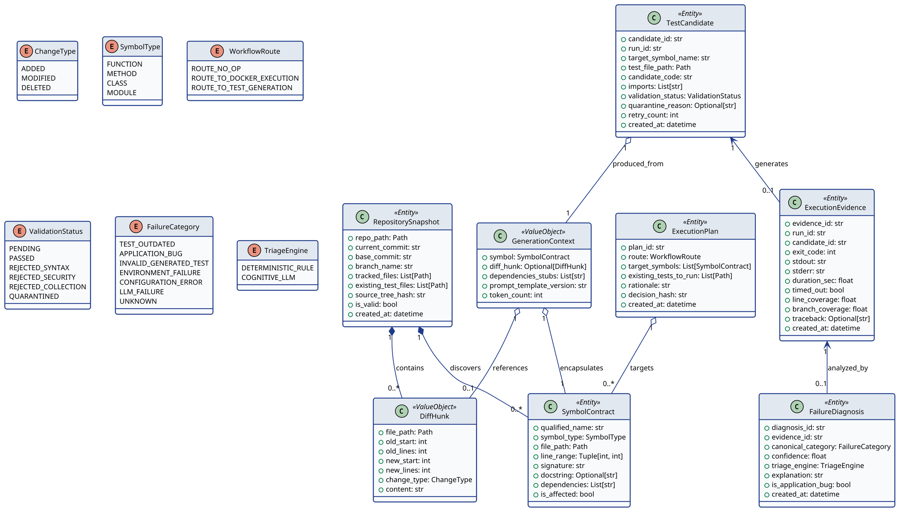

## 4.3 Stage 2: Increment 1 Analysis & Specification Refinement

---

### 4.3.1 Increment 1 Functional Requirements Refinement
To translate high-level system objectives into verifiable engineering deliverables, functional requirements for Increment 1 are categorized across six cohesive functional domains (Domains 1 through 6). Each requirement is assigned a permanent identifier (`FR-01` through `FR-20`), a formal normative statement, architectural rationale, dependency constraints, and explicit acceptance criteria.

#### 4.3.1.1 Domain 1: Repository Ingestion and Analysis (FR-01 to FR-04)

* **[FR-01] Repository Structure and Metadata Validation**
  * **Statement**: The system shall validate that a specified local directory is a valid Git repository, extract core Git metadata (current commit SHA, branch name, remote origin, and base comparison commit), and verify that required configuration files exist.
  * **Rationale**: Upstream operations depend on a well-formed Git environment to compute diffs and locate source trees deterministically. Non-repository paths must be rejected immediately to prevent corrupt state transitions.
  * **Dependencies**: None (Entry point requirement).
  * **Acceptance Criteria**: The system accepts valid Git repositories, extracts the HEAD commit SHA (40-character hex string), rejects non-existent or uninitialized directories with an explicit `RepositoryValidationError`, and populates `RepositorySnapshot.is_valid = True`.

* **[FR-02] Working Tree Diff and Change Extraction**
  * **Statement**: The system shall compute the unified diff between the current working tree (or target commit) and the baseline reference commit, extracting file paths, modification types (`ADDED`, `MODIFIED`, `DELETED`), and individual change hunks (`old_start`, `old_lines`, `new_start`, `new_lines`).
  * **Rationale**: Focusing test generation strictly on modified or newly added code avoids full-repository re-generation, minimizing computational overhead and cognitive token expenditure.
  * **Dependencies**: FR-01.
  * **Acceptance Criteria**: Given unstaged or committed changes, the system outputs structured `DiffHunk` records mapping exactly to `git diff` semantics, ignoring binary files, virtual environments (`.venv`, `venv`), cache directories (`__pycache__`), and `.git` internal metadata.

* **[FR-03] Static Abstract Syntax Tree (AST) Parsing**
  * **Statement**: The system shall parse target Python source files into standard Abstract Syntax Trees without executing application code, extracting symbols (modules, classes, methods, functions), docstrings, type annotations, signatures, and module-level imports.
  * **Rationale**: Dynamic code execution during analysis poses severe security risks and can cause unintended side effects. Pure static AST analysis provides structural metadata safely and deterministically.
  * **Dependencies**: FR-01, FR-02.
  * **Acceptance Criteria**: The AST parser processes all syntactically valid Python 3.11+ source files, records parse errors for malformed files without terminating the run, and populates `SymbolContract` entities with exact source line boundaries (`start_line`, `end_line`).

* **[FR-04] Change-to-Symbol Mapping and Test Discovery**
  * **Statement**: The system shall cross-reference extracted diff hunks with AST symbol boundaries to determine `affected_symbols`, and discover all existing `pytest` test files and test functions within the repository.
  * **Rationale**: Connecting changed lines to high-level symbols allows the system to determine which functions or methods were altered and discover whether existing tests already exercise those symbols.
  * **Dependencies**: FR-02, FR-03.
  * **Acceptance Criteria**: A symbol is classified as `affected` if any diff hunk overlaps with its line range $[start\_line, end\_line]$. Existing test files matching `test_*.py` or `*_test.py` are mapped to target symbols with 100% precision.

---

#### 4.3.1.2 Domain 2: Deterministic Planning and Routing (FR-05, FR-06)

* **[FR-05] Deterministic Workflow Route Selection**
  * **Statement**: The system shall evaluate the set of affected symbols and discovered existing tests to determine the execution route deterministically, adhering to three mutually exclusive outcomes: `ROUTE_NO_OP` (no relevant changes), `ROUTE_TO_DOCKER_EXECUTION` (affected symbols covered by existing tests), or `ROUTE_TO_TEST_GENERATION` (uncovered affected symbols detected).
  * **Rationale**: Enforcing a deterministic routing gate guarantees that expensive and probabilistic LLM generation is never invoked when existing tests suffice or when changes are irrelevant to testable logic.
  * **Dependencies**: FR-04.
  * **Acceptance Criteria**: Given zero diff hunks or changes restricted to documentation/markdown, the planner selects `ROUTE_NO_OP`. Given changes covered by existing tests, it selects `ROUTE_TO_DOCKER_EXECUTION`. It selects `ROUTE_TO_TEST_GENERATION` if and only if at least one affected callable symbol lacks corresponding test coverage.

* **[FR-06] Deterministic Test Execution Planning**
  * **Statement**: The system shall synthesize a structured `ExecutionPlan` detailing the selected route, the ordered sequence of target symbols requiring test synthesis, the list of existing test files to execute as regression baselines, and a cryptographic decision hash.
  * **Rationale**: Structured plans provide complete auditability, enabling the orchestrator and downstream execution engines to proceed with verified, immutable execution instructions.
  * **Dependencies**: FR-05.
  * **Acceptance Criteria**: An `ExecutionPlan` object is generated with a unique `plan_id`, valid route enum, non-empty target symbol list (when route is `ROUTE_TO_TEST_GENERATION`), and written to the `WorkflowState`.

---

#### 4.3.1.3 Domain 3: Test Generation (FR-07, FR-08)

* **[FR-07] Bounded Context Assembly for Test Generation**
  * **Statement**: The system shall assemble a bounded, symbol-specific context prompt containing target symbol source code, signature and type hints, relevant docstrings, imported module dependencies, related class interfaces, and working tree diff hunks, while truncating inputs exceeding defined token budgets.
  * **Rationale**: Unbounded context degrades LLM attention and inflates inference costs. Bounded, modular context assembly provides the model with only the structural information required to synthesize accurate unit tests.
  * **Dependencies**: FR-03, FR-06.
  * **Acceptance Criteria**: The assembled prompt does not exceed the model token threshold (e.g., 4,000 tokens for context), contains the complete target function implementation, and masks sensitive secrets or environment variables.

* **[FR-08] Structured Unit-Test Synthesis & Bounded Candidate Repair**
  * **Statement**: The system shall invoke the configured LLM through a standardized gateway to synthesize idiomatic `pytest` unit test candidates, enforcing structured output containing test code, required fixtures, imported modules, and targeted edge cases. The synthesis process shall support bounded internal candidate repair/regeneration (up to $R_{max}=2$ retries) when generated code exhibits repairable construction defects (malformed JSON, incomplete syntax, or formatting anomalies) before submitting candidates to the final validation pipeline.
  * **Rationale**: Unit tests must adhere to `pytest` conventions, including parameterized test cases, mock fixtures, and clear assertion semantics. Bounded internal repair enables the generation subsystem to self-correct minor formatting or structural hallucinations without leaking retry logic into validation or execution layers.
  * **Dependencies**: FR-07.
  * **Acceptance Criteria**: The LLM returns a validated structured payload containing `candidate_code` with valid syntax, imports, and assertions. If repairable defects occur, internal candidate repair is executed up to $R_{max}=2$ attempts; candidates failing internal repair are isolated before reaching validation.

---

#### 4.3.1.4 Domain 4: Test Validation (FR-09, FR-10)

* **[FR-09] Multi-Gate Pre-Execution Validation Pipeline**
  * **Statement**: The system shall subject all synthesized test candidates to a sequential, non-regenerative multi-gate validation pipeline prior to container execution:
    1. *Gate 1 (Syntax Validation)*: Parse candidate code with `ast.parse` to ensure 100% syntactic compliance.
    2. *Gate 2 (Static Security Screening)*: Analyze candidate AST using a Bandit-based visitor to detect prohibited calls (`os.system`, `subprocess`, `eval`, `exec`, network socket creation, filesystem writes outside temp dirs).
    3. *Gate 3 (Pytest Collection Dry-Run)*: Validate test collection using `pytest --collect-only` to verify import resolution and fixture existence.
  * **Rationale**: Multi-gate screening serves as an authoritative, final acceptance boundary that rejects flawed or dangerous candidates in microseconds, shielding the Docker infrastructure from untrusted code execution and eliminating unnecessary container spin-up latencies. The pipeline evaluates acceptability without initiating downstream regeneration loops.
  * **Dependencies**: FR-08.
  * **Acceptance Criteria**: Candidates failing any gate are immediately marked as `REJECTED`, assigned an explicit validation error code, and permanently barred from dynamic execution; zero regeneration loops are triggered from the validation pipeline.

* **[FR-10] Candidate Test Rejection and Quarantine**
  * **Statement**: The system shall isolate rejected test candidates into a quarantine repository, recording the raw candidate code, failing gate ID (`GATE_1_SYNTAX`, `GATE_2_SECURITY`, `GATE_3_COLLECTION`), error message, and rejection timestamp. Because the validation pipeline acts as a final acceptance boundary, validation failures do not trigger regeneration cycles; rejected candidates are immediately quarantined.
  * **Rationale**: Quarantining defective candidates preserves glass-box audit trails and ensures that untrusted or flawed code cannot enter execution environments. Separating validation from regeneration prevents infinite cycles and reinforces strict architectural boundaries.
  * **Dependencies**: FR-09.
  * **Acceptance Criteria**: Quarantined candidates are written to SQLite and disk artifacts with status `QUARANTINED`. Security violations (`GATE_2_SECURITY`) and structural gate failures are marked as non-retryable and excluded from automated execution.

---

#### 4.3.1.5 Domain 5: Test Execution and Evidence Collection (FR-11 to FR-17)

* **[FR-11] Isolated Container Sandbox Execution**
  * **Statement**: The system shall execute all validated test candidates and regression test suites inside an isolated, ephemeral Docker container instantiated from a hardened base image (`agentic-runner:0.1.0`).
  * **Rationale**: Containerized isolation ensures that executed tests cannot damage the host filesystem, alter developer configurations, or compromise system integrity.
  * **Dependencies**: FR-09.
  * **Acceptance Criteria**: Tests execute strictly within the Docker container lifecycle; containers are spawned on demand and destroyed immediately upon test completion (`auto_remove = True`).

* **[FR-12] Sandbox Network Confinement**
  * **Statement**: The system shall configure the execution container with disabled networking (`--network none`), blocking all inbound and outbound network traffic.
  * **Rationale**: Prevents generated tests from performing remote data exfiltration, accessing external cloud APIs, or introducing distributed side effects.
  * **Dependencies**: FR-11.
  * **Acceptance Criteria**: Container execution fails immediately with socket or connection errors if any executed test attempts an external network request; zero network bytes transmitted across the container interface.

* **[FR-13] Execution Timeout Enforcement**
  * **Statement**: The system shall enforce a strict wall-clock execution timeout of 30.0 seconds per test execution session, forcibly terminating containers exceeding this threshold.
  * **Rationale**: Protects the orchestrator from freezing due to infinite loops, deadlocks, or sleeping processes in generated code.
  * **Dependencies**: FR-11.
  * **Acceptance Criteria**: Any test suite exceeding 30.0 seconds triggers a host-side timer that issues a `SIGKILL` to the container, returning an `ExecutionEvidence` record with `timed_out = True` and exit code `124`.

* **[FR-14] Execution Resource Quota Enforcement**
  * **Statement**: The system shall constrain container execution resources using Linux cgroups, enforcing a maximum memory limit of 512 MB, CPU quota of 1.0 virtual core, and a process limit of 100 PIDs.
  * **Rationale**: Restricts resource consumption, preventing Denial of Service (DoS) conditions, memory ballooning, or fork bombs on the host system.
  * **Dependencies**: FR-11.
  * **Acceptance Criteria**: Containers attempting to allocate over 512 MB RAM are terminated by the kernel OOM killer with exit code `137`, leaving host operating system memory unaffected.

* **[FR-15] Application Source-Code Protection**
  * **Statement**: The system shall mount the host application repository into the container with strict read-only permissions (`:ro`), confining test code execution to a separate ephemeral scratch volume.
  * **Rationale**: Guarantees that neither executed tests nor test runners can mutate production application source code.
  * **Dependencies**: FR-11.
  * **Acceptance Criteria**: Any write attempt to application files results in an OS-level `EROFS` (Read-only file system) error; pre/post-execution SHA-256 source tree hashes remain identical.

* **[FR-16] Test Runner Invocation and Telemetry Capture**
  * **Statement**: The system shall invoke `pytest` inside the container with structured telemetry flags (`--tb=short`, `-v`, `--junitxml`), capturing exit codes, standard output (`stdout`), standard error (`stderr`), and individual test case outcomes (`PASSED`, `FAILED`, `SKIPPED`).
  * **Rationale**: Comprehensive telemetry capture provides the raw empirical evidence needed for failure diagnosis and coverage analysis.
  * **Dependencies**: FR-11, FR-15.
  * **Acceptance Criteria**: The system parses the resulting execution output into a structured `ExecutionEvidence` object, capturing full tracebacks for failing assertions.

* **[FR-17] Code Coverage Metric Extraction**
  * **Statement**: The system shall execute test candidates with `pytest-cov`, generating machine-readable coverage data (`coverage.json`), and extract statement and branch coverage percentages for all target symbols.
  * **Rationale**: Quantifying coverage changes verifies that generated tests exercise previously uncovered logic paths, measuring empirical utility.
  * **Dependencies**: FR-16.
  * **Acceptance Criteria**: The system records `line_coverage`, `branch_coverage`, and coverage deltas ($\Delta Cov = Cov_{post} - Cov_{pre}$) within the execution evidence record.

---

#### 4.3.1.6 Domain 6: Failure Assessment and Disambiguation (FR-18 to FR-20)

* **[FR-18] Rule-Based Deterministic Failure Triage**
  * **Statement**: The system shall evaluate execution tracebacks against deterministic regex rules and error classification patterns to triage syntax, import, timeout, and environment failures without invoking cognitive models.
  * **Rationale**: Deterministic pattern matching handles standard runtime failures (e.g., `ModuleNotFoundError`, container timeout) instantly with 100% accuracy and zero token cost.
  * **Dependencies**: FR-16.
  * **Acceptance Criteria**: Failures matching deterministic error signatures (e.g., `ExitCode 124` $\rightarrow$ `ENVIRONMENT_FAILURE`, `ModuleNotFoundError` $\rightarrow$ `CONFIGURATION_ERROR`, syntax/fixture error in test $\rightarrow$ `INVALID_GENERATED_TEST`) are categorized immediately with confidence `1.0`.

* **[FR-19] Cognitive Failure Classification Across Canonical Taxonomy**
  * **Statement**: For failures not resolvable by deterministic rules, the system shall assemble execution evidence, diff context, and target symbol ASTs to prompt an LLM classifier, disambiguating failures across the canonical 7-category taxonomy: `TEST_OUTDATED`, `APPLICATION_BUG`, `INVALID_GENERATED_TEST`, `ENVIRONMENT_FAILURE`, `CONFIGURATION_ERROR`, `LLM_FAILURE`, or `UNKNOWN`.
  * **Rationale**: Disambiguating subtle assertion failures requires semantic reasoning to determine whether the failure stems from a defect in the application or an invalid assumption in the test.
  * **Dependencies**: FR-16, FR-18.
  * **Acceptance Criteria**: The cognitive classifier returns a `FailureDiagnosis` containing the canonical category, a confidence score $[0.0, 1.0]$, and a structured natural language explanation of the root cause.

* **[FR-20] Application Defect Flagging & Developer Review Isolation**
  * **Statement**: When a failure is diagnosed as `APPLICATION_BUG`, the system shall flag the result as a potential production defect, isolate all relevant execution evidence and tracebacks into a dedicated review report, and strictly prohibit automated test repair.
  * **Rationale**: The system is designed for test lifecycle management, not automated program repair. Concealing application bugs by modifying tests to pass would compromise software quality.
  * **Dependencies**: FR-19.
  * **Acceptance Criteria**: Diagnoses marked `APPLICATION_BUG` are highlighted with prominent warning banners in the CLI, stored in SQLite as requiring human investigation, and prevented from entering test maintenance loops.

---

### 4.3.2 Observable Operational Scenarios & Refined Use-Case Walkthroughs
To illustrate dynamic system behavior during Increment 1 execution, this section details the operational walkthroughs for the six core use cases (`UC-01` through `UC-06`). Each specification documents preconditions, triggers, primary actors, main success scenarios (MSS) with state transitions, alternative/failure flows, postconditions, and requirements traceability.

#### 4.3.2.1 UC-01: Ingest and Analyze Repository
* **Primary Actor**: Software Developer / QA Engineer.
* **Preconditions**: Target Python repository exists on local filesystem; Git is initialized; host environment meets prerequisites.
* **Trigger**: Developer executes `agentic-test run --repo <path>` via CLI.
* **Main Success Scenario (MSS)**:
  1. System receives repository path and validates directory accessibility.
  2. `GitService` verifies that the target path is a valid Git repository (`FR-01`).
  3. `GitService` retrieves HEAD commit SHA, current branch name, and base commit.
  4. `GitService` computes working tree diff against base commit and extracts `DiffHunk` records (`FR-02`).
  5. `PythonASTAnalyzer` parses all tracked Python files into ASTs, extracting symbols, annotations, and docstrings (`FR-03`).
  6. `TestDiscovery` identifies existing test files matching `test_*.py` and extracts existing test case signatures.
  7. System cross-references `DiffHunk` line ranges with AST symbol ranges to identify `affected_symbols` (`FR-04`).
  8. System instantiates `RepositorySnapshot` and initializes `WorkflowState`.
* **Extensions (Alternative & Failure Flows)**:
  * *2a. Directory is not a valid Git repository*:
    * 2a1. System emits error log: `Invalid Git repository path`.
    * 2a2. System terminates execution with exit code `2`.
  * *5a. Syntax error detected in existing repository file*:
    * 5a1. System records file parse exception in `AnalysisResult.syntax_errors`.
    * 5a2. System skips defective file and continues analyzing remaining valid Python files.
* **Postconditions**: `WorkflowState.snapshot` is populated; repository metadata, diff hunks, and affected symbols are immutably stored.
* **Traceability**: FR-01, FR-02, FR-03, FR-04.

---

#### 4.3.2.2 UC-02: Plan Workflow Execution
* **Primary Actor**: Automated Orchestrator.
* **Preconditions**: `UC-01` completed successfully; `WorkflowState.snapshot` contains valid diff and symbol data.
* **Trigger**: Completion of repository analysis.
* **Main Success Scenario (MSS)**:
  1. `ExecutionPlanner` receives `git_diff`, `affected_symbols`, and `existing_tests` from `WorkflowState`.
  2. Planner verifies whether diff hunks contain testable code changes.
  3. Planner checks whether existing tests cover all affected symbols.
  4. Detecting uncovered affected symbols, planner selects `ROUTE_TO_TEST_GENERATION` (`FR-05`).
  5. Planner orders target symbols by dependency hierarchy (independent functions first, followed by classes).
  6. Planner constructs immutable `ExecutionPlan` recording route, target symbols, and rationale (`FR-06`).
  7. System updates `WorkflowState.plan` and emits `PLANNING_COMPLETE` event.
* **Extensions (Alternative & Failure Flows)**:
  * *2a. Diff hunks contain zero modifications (clean working tree)*:
    * 2a1. Planner selects `ROUTE_NO_OP` with rationale: `No working tree modifications detected`.
    * 2a2. Workflow transitions directly to report generation and terminates successfully.
  * *3a. All affected symbols are already covered by existing tests*:
    * 3a1. Planner selects `ROUTE_TO_DOCKER_EXECUTION` with rationale: `Regression verification for existing tests`.
    * 3a2. Workflow bypasses test generation and transitions directly to `UC-05` (Sandbox Execution).
* **Postconditions**: `WorkflowState.plan` contains validated route and prioritized target symbols.
* **Traceability**: FR-05, FR-06.

---

#### 4.3.2.3 UC-03: Generate Unit Tests
* **Primary Actor**: Cognitive Generation Subsystem.
* **Preconditions**: `UC-02` completed; `ExecutionPlan.route == ROUTE_TO_TEST_GENERATION`.
* **Trigger**: Orchestrator enters `generate_tests_node`.
* **Main Success Scenario (MSS)**:
  1. `ContextAssembler` iterates over target symbols in `ExecutionPlan`.
  2. For each symbol, assembler gathers target AST, signature, docstring, dependencies, and diff hunk (`FR-07`).
  3. Assembler verifies token count against model budget, applying pruning if required.
  4. System formats structured prompt utilizing standard test synthesis prompt template.
  5. System invokes `LLMService` passing structured prompt with `temperature = 0.0`.
  6. `LiteLLMService` transmits request to configured LLM gateway and receives structured JSON response.
  7. System checks generated candidate code for repairable construction defects (malformed JSON, incomplete syntax, or formatting errors) (`FR-08`).
  8. If repairable defects are detected and candidate repair retries remain ($r < R_{max}$, where $R_{max}=2$), `GenerationService` performs internal candidate repair:
     * System formats defect traceback as targeted prompt feedback.
     * `GenerationService` invokes `regenerate_with_feedback(symbol, error_trace)`.
     * System increments internal candidate repair retry count ($r = r + 1$).
  9. System parses final response into `TestCandidate` entity containing `candidate_code`, imports, assertions, and `retry_count`.
  10. System appends candidate to `WorkflowState.candidates` with status `PENDING_VALIDATION`, ready for final validation.
* **Extensions (Alternative & Failure Flows)**:
  * *6a. Upstream LLM gateway returns rate limit (HTTP 429) or timeout*:
    * 6a1. `LiteLLMService` triggers exponential backoff retry (up to 3 attempts).
    * 6a2. If retries fail, service invokes fallback model endpoint.
    * 6a3. If all endpoints fail, system records `LLM_FAILURE` and aborts generation for this symbol.
  * *8a. Candidate exhibits unrecoverable defects after exhausting repair retry budget ($r \ge 2$)*:
    * 8a1. Candidate is flagged as `MALFORMED_OUTPUT` and quarantined prior to validation.
    * 8a2. System logs candidate generation failure and proceeds with remaining target symbols.
* **Postconditions**: Finalized `TestCandidate` records are added to `WorkflowState.candidates` with status `PENDING_VALIDATION`.
* **Traceability**: FR-07, FR-08.

---

#### 4.3.2.4 UC-04: Validate Generated Tests
* **Primary Actor**: Multi-Gate Validation Subsystem.
* **Preconditions**: `UC-03` completed; `WorkflowState.candidates` contains `PENDING_VALIDATION` candidates. The validation pipeline serves as a final, non-regenerative acceptance boundary.
* **Trigger**: Orchestrator enters `validate_candidates_node`.
* **Main Success Scenario (MSS)**:
  1. `ValidationPipeline` pulls pending candidates from `WorkflowState`.
  2. **Gate 1 (Syntax)**: Pipeline executes `ast.parse(candidate.test_code)` (`FR-09`). Syntax is valid.
  3. **Gate 2 (Security)**: Bandit static AST visitor scans code for blacklisted symbols (`eval`, `subprocess`, socket APIs). Zero security violations detected (`FR-09`).
  4. **Gate 3 (Collection)**: Pipeline writes test code to temporary scratch file and executes `pytest --collect-only` in host environment. Test functions and fixtures collect successfully (`FR-09`).
  5. Candidate validation status is updated to `PASSED`.
  6. Validated candidate is staged for container execution.
* **Extensions (Alternative & Failure Flows)**:
  * *2a. Gate 1 fails (Python syntax error in generated code)*:
    * 2a1. Pipeline rejects candidate, sets status to `REJECTED_SYNTAX`, and records traceback (`FR-10`).
    * 2a2. Candidate is moved directly to quarantine repository; no downstream regeneration loop is initiated.
  * *3a. Gate 2 fails (Prohibited import or unsafe function detected)*:
    * 3a1. Pipeline immediately rejects candidate with security fault `SECURITY_VIOLATION_BLOCKED` (`FR-10`).
    * 3a2. Candidate is permanently quarantined; security violations are strictly non-retryable.
  * *4a. Gate 3 fails (Collection error, unresolvable import or missing fixture)*:
    * 4a1. Pipeline marks candidate as `REJECTED_COLLECTION` and records collection error output (`FR-10`).
    * 4a2. Candidate is moved directly to quarantine repository; no downstream regeneration loop is initiated.
  * *5a. Zero candidates achieve PASSED status*:
    * 5a1. System records that all candidates failed multi-gate screening.
    * 5a2. Orchestrator bypasses container sandbox execution and transitions directly to `report_node` (quarantine reporting).
* **Postconditions**: All candidates categorized as either `PASSED` (staged for sandbox) or `REJECTED` (quarantined). The validation pipeline initiates zero regeneration loops.
* **Traceability**: FR-09, FR-10.

---

#### 4.3.2.5 UC-05: Execute Tests & Capture Evidence
* **Primary Actor**: Sandbox Execution Subsystem.
* **Preconditions**: `UC-04` completed with at least one candidate having status `PASSED` (or existing tests routed).
* **Trigger**: Orchestrator enters `execute_sandbox_node`.
* **Main Success Scenario (MSS)**:
  1. `ExecutionService` computes baseline SHA-256 hash of all repository production source files (`FR-15`).
  2. `DockerSandboxManager` provisions ephemeral container using `agentic-runner:0.1.0` image (`FR-11`).
  3. Manager applies security constraints: `--network none` (`FR-12`), `--memory 512m` (`FR-14`), `--cpus 1.0`, `--pids-limit 100`, user `uid=10001`.
  4. Application repository is mounted read-only (`:ro`) at `/workspace/src` (`FR-15`).
  5. Validated test candidates are mounted at `/workspace/tests` in an isolated scratch volume.
  6. `PytestRunner` executes test command: `pytest tests/ --cov=/workspace/src --cov-report=json` with 30s timeout (`FR-13`, FR-16).
  7. Container executes tests to completion and exits cleanly with exit code `0`.
  8. `CoverageExtractor` parses generated `coverage.json` extracting statement and branch coverage (`FR-17`).
  9. System re-computes source tree SHA-256 hashes, verifying zero production modifications (`FR-15`).
  10. Container is destroyed and removed (`FR-11`).
  11. `ExecutionEvidence` record is populated with stdout, stderr, execution time, and coverage metrics.
* **Extensions (Alternative & Failure Flows)**:
  * *6a. Execution exceeds wall-clock timeout (30.0 seconds)*:
    * 6a1. Host timer fires; Docker client issues container `kill` (`SIGKILL`).
    * 6a2. Evidence recorded with `timed_out = True`, exit code `124`.
    * 6a3. Execution transitions to `UC-06` (Failure Diagnosis).
  * *6b. Memory consumption exceeds 512 MB*:
    * 6b1. Linux kernel OOM killer terminates container process.
    * 6b2. Evidence recorded with `exit_code = 137` (OOM killed).
    * 6b3. Execution transitions to `UC-06` (Failure Diagnosis).
  * *7a. Test assertion fails or runtime exception raised (exit code != 0)*:
    * 7a1. Pytest captures failing traceback in stdout/stderr.
    * 7a2. Evidence captured with `exit_code = 1`.
    * 7a3. Execution transitions to `UC-06` (Failure Diagnosis).
  * *9a. Production source SHA-256 hash mismatch detected*:
    * 9a1. System triggers critical security alert: `PRODUCTION_SOURCE_INTEGRITY_VIOLATION`.
    * 9a2. Workflow is halted immediately; run marked as failed.
* **Postconditions**: Ephemeral container terminated; immutable `ExecutionEvidence` stored in `WorkflowState`.
* **Traceability**: FR-11, FR-12, FR-13, FR-14, FR-15, FR-16, FR-17.

---

#### 4.3.2.6 UC-06: Disambiguate Test Failures
* **Primary Actor**: Dual-Engine Diagnosis Subsystem.
* **Preconditions**: `UC-05` completed with failing test cases (`ExecutionEvidence.exit_code != 0`).
* **Trigger**: Orchestrator enters `diagnose_failure_node`.
* **Main Success Scenario (MSS)**:
  1. `DiagnosisService` receives failing `ExecutionEvidence` and associated test candidate.
  2. **Engine 1 (Deterministic Triage)**: Service evaluates regex rules against traceback (`FR-18`):
     * Checks for container timeout (`timed_out == True` $\rightarrow$ `ENVIRONMENT_FAILURE`).
     * Checks for missing packages (`ModuleNotFoundError` $\rightarrow$ `CONFIGURATION_ERROR`).
     * Checks for test syntax/name error (`NameError` in test body $\rightarrow$ `INVALID_GENERATED_TEST`).
  3. If deterministic rule matches, failure is categorized immediately with confidence `1.0` and rationale.
  4. If no rule matches (assertion error or application traceback), execution proceeds to **Engine 2 (Cognitive LLM Triage)** (`FR-19`).
  5. Engine 2 constructs diagnosis prompt containing failing assertion, traceback, working tree diff, and target AST.
  6. Model analyzes failure and returns structured diagnosis: category (`TEST_OUTDATED` vs `APPLICATION_BUG`), confidence, and explanation (`FR-19`).
  7. If classified as `APPLICATION_BUG`, system flags the defect for developer review without auto-repair (`FR-20`).
  8. `FailureDiagnosis` record is created, attached to `WorkflowState.diagnoses`, and persisted to SQLite.
* **Extensions (Alternative & Failure Flows)**:
  * *6a. LLM triage confidence is below threshold (< 0.70)*:
    * 6a1. Failure is categorized as `UNKNOWN` with confidence score recorded.
    * 6a2. System logs low-confidence alert requesting developer inspection.
  * *6b. LLM API fails during cognitive triage*:
    * 6b1. Fallback heuristic categorizes failure as `UNKNOWN` with error explanation.
* **Postconditions**: Failure is categorized into one of 7 canonical classes; diagnostic record saved.
* **Traceability**: FR-18, FR-19, FR-20.

---

### 4.3.3 Domain Data Model & Entity Specifications for Increment 1
To ensure end-to-end data integrity, all internal state transitions operate on strongly typed, immutable domain entities defined via Pydantic v2. Figure 4.1 illustrates the Domain Data Model and Entity Relationship Diagram, defining entity structures, attributes, and relationships across Increment 1.

#### Detailed Entity Specifications:
1. **`RepositorySnapshot`**: Represents an immutable point-in-time capture of the target Git repository, tracking commit SHAs, file inventories, and baseline source tree cryptographic checksums (`SHA-256`).
2. **`DiffHunk`**: A value object representing a unified diff block, encapsulating line changes and patch modifications.
3. **`SymbolContract`**: Defines the structural interface of a Python callable, capturing its qualified name, parameter types, return annotations, line boundaries, and AST dependency imports.
4. **`ExecutionPlan`**: The deterministic output of the planning phase, binding the workflow route to target symbols and cryptographic audit hashes.
5. **`GenerationContext`**: A value object packaging the exact structural and diff context passed into the cognitive generation model.
6. **`TestCandidate`**: Represents a synthesized test suite candidate, tracking its source code, imports, internal candidate-repair retry count ($0 \le \text{retry\_count} \le 2$), final multi-gate validation lifecycle, and quarantine metadata.
7. **`ExecutionEvidence`**: The empirical result emitted by sandbox execution, containing exact exit codes, stdout/stderr streams, execution duration, and pytest-cov metrics.
8. **`FailureDiagnosis`**: The diagnostic outcome generated by the dual-engine triage subsystem, classifying execution failures across the canonical 7-category taxonomy with confidence scoring.

---

### 4.3.4 Operational Constraints & Execution Safety Invariants
To guarantee that system execution remains provably secure, deterministic, and non-destructive, Increment 1 formally specifies and enforces four foundational safety invariants (`INV-01` through `INV-04`), supported by mathematical execution boundaries.

#### 1. INV-01: Ephemeral Container & Network Isolation Boundary
* **Formal Predicate**:
  $$\forall e \in \text{Executions} : \text{NetInterfaces}(e) = \emptyset \land \text{Lifetime}(e) \le T_{max} \land \text{Privileges}(e) = \text{NonRoot}$$
* **Specification**: All dynamic code execution must take place within an isolated Docker container configured with `--network none`, `--cap-drop all`, `--security-opt no-new-privileges`, and non-root user `uid=10001`. The container must be ephemeral and automatically purged upon execution termination.
* **Mathematical Bound**:
  * Wall-clock execution timeout $T_{max} = 30.0\,\text{s}$. If process duration $t > T_{max}$, host initiates `SIGKILL` after a $5.0\,\text{s}$ grace period.
  * Memory ceiling $M_{max} = 512\,\text{MB}$.
  * CPU quota $C_{max} = 1.0\,\text{vCPU}$ (100,000 $\mu s$ period / 100,000 $\mu s$ quota).
  * Process table ceiling $P_{max} = 100\,\text{PIDs}$.

#### 2. INV-02: Production Source-Code Read-Only Protection
* **Formal Predicate**:
  $$\text{Hash}_{SHA256}(\text{SourceTree}_{pre}) = \text{Hash}_{SHA256}(\text{SourceTree}_{post})$$
* **Specification**: The target application source tree (`src/`) must be mounted into the execution sandbox with immutable read-only flags (`:ro`). The system is architecturally prohibited from writing to production source files. Cryptographic SHA-256 hashes of all source files are computed immediately prior to container launch and compared against post-execution hashes. Any discrepancy halts the workflow and triggers an immediate integrity failure.

#### 3. INV-03: Deterministic Planning Precedence (Zero-LLM Gate)
* **Formal Predicate**:
  $$\text{Route}(\text{Run}) \ne \text{ROUTE\_TO\_TEST\_GENERATION} \iff \text{Diff} = \emptyset \lor \text{AffectedSymbols} \subseteq \text{CoveredSymbols}$$
* **Specification**: The Test Generation LLM must never be invoked prior to the completion of the deterministic static analysis and planning phase. If the working tree diff is empty or if all affected symbols possess pre-existing passing tests, cognitive generation is blocked with mathematical certainty. Probabilistic model invocation occurs if and only if deterministic logic verifies uncovered affected symbols.

#### 4. INV-04: Non-Negotiable Developer-Mediated Mutation Boundary
* **Formal Predicate**:
  $$\forall c \in \text{TestCandidates} : \text{WriteToHostGit}(c) = \text{False}$$
* **Specification**: Increment 1 is strictly prohibited from performing automated Git commits, merges, pushes, or direct repository modifications. Generated tests reside exclusively in isolated artifact directories (`.agentic_test/runs/<run_id>/candidates/`). Any subsequent application of test patches to developer repositories is strictly reserved for developer-mediated governance in Increment 3.

---
